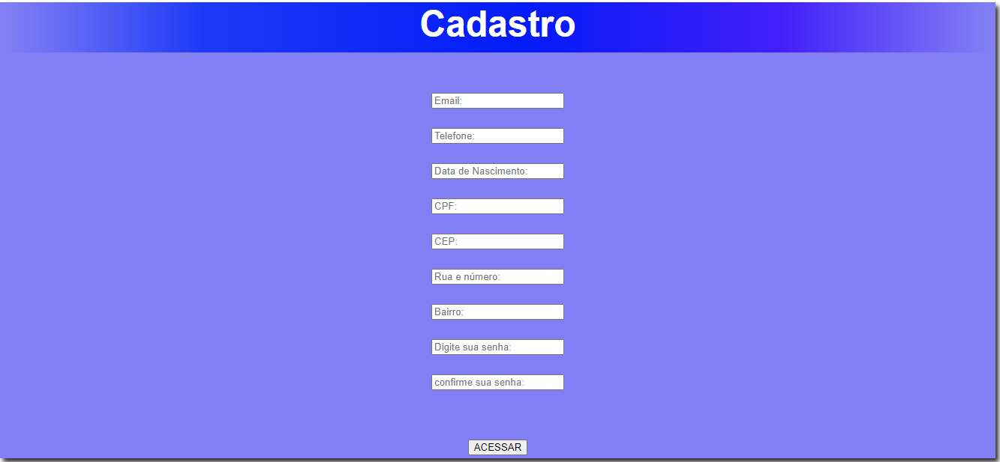

<h1 align="center"> Formulário de cadastro de e e-commerce como americanas e magazine Luiza</h1>

# 🚀 Projeto - Cadastro para a escrita do README

## 📝 Descrição
Este projeto consiste em uma tela de cadstro, na qual se solicita:
-Email
-Telefone
-Data de nascimento
-CPF
-CEP
-Rua e número 
-Bairro
-Senha
## ⚙️ Funcionalidades

1-Formulário de preenchimento

2-Validação de dados

3-Confirmação de senha

4-Política de privacidade e termos de uso

5-Botão de envio ou registro

6-Mensagens de erro

### 💻 Tecnologias utilizadas

- Git  

- GitHub  

- HTML  

- CSS  

- Vs Code   

 
## 🔎 Fontes consultadas

Leonardo Rocha

## 🙎🏽 Autores

Ruan Pablo, 

